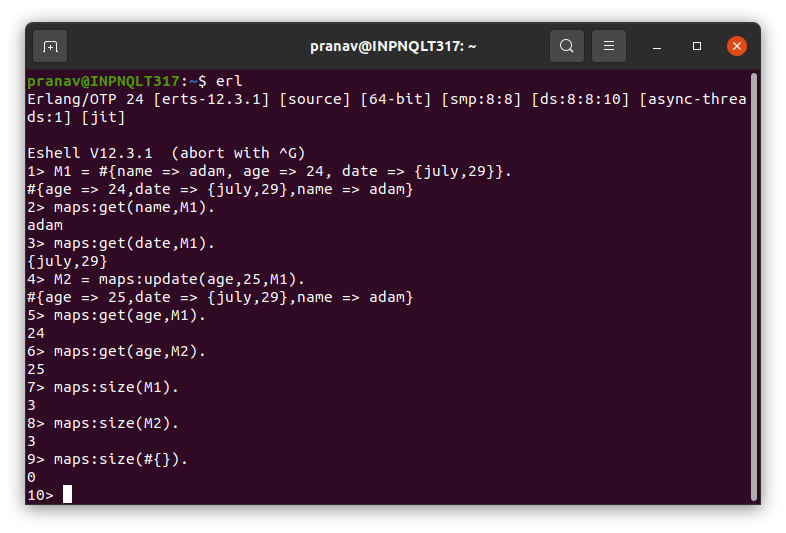

# Erlang-Assignments
## Week 1

- [Create Variable in the Shell](#create-variable-in-the-shell)
- [Seeing Your Bound Variables](#seeing-your-bound-variables)
- [Clearing Bound Variables in the Shell for a particular variable](#clearing-bound-variables-in-the-shell-for-a-particular-variable)
- [Clearing All Bound Variable in the Shell](#clearing-all-bound-variable-in-the-shell)
- [Formatting Output using io:format (~s)](#formatting-output-using-ioformat-s)
- [Formatting Output using io:format (~w)](#formatting-output-using-ioformat-w)
- [Formatting Output using io:format (~p)](#formatting-output-using-ioformat-p)
- [Create Integers and Floats](#create-integers-and-floats)
- [Create Constants using define (Code)](#create-constants-using-define-code)
- [Create Constants using define (Terminal)](#create-constants-using-define-terminal)
- [Create Atoms](#create-atoms)
- [Boolean Atoms how to create and use](#boolean-atoms-how-to-create-and-use)
- [List Basic Operations and Spilting List into Head and Tail](#list-basic-operations-and-spilting-list-into-head-and-tail)
- [Create Tuples](#create-tuples)
- [Build List of Lists](#build-list-of-lists)
- [Create Pattern Matching With Atoms (Code)](#create-pattern-matching-with-atoms-code)
- [Create Pattern Matching With Atoms (Terminal)](#create-pattern-matching-with-atoms-terminal)
- [Create Pattern Matching With Tuples (Code)](#create-pattern-matching-with-tuples-code)
- [Create Pattern Matching With Tuples (Terminal)](#create-pattern-matching-with-tuples-terminal)
- [Create Binaries](#create-binaries)
- [Convert Binary to list, tuples, float, integers, atoms, terms](#convert-binary-to-list-tuples-float-integers-atoms-terms)
- [Create examples with If Statements inside functions (Code)](#create-examples-with-if-statements-inside-functions-code)
- [Create examples with If Statements inside functions (Terminal)](#create-examples-with-if-statements-inside-functions-terminal)
- [Create examples with Case Statements inside functions (Code)](#create-examples-with-case-statements-inside-functions-code)
- [Create examples with Case Statements inside functions (Terminal)](#create-examples-with-case-statements-inside-functions-terminal)
- [Mapping Data using Maps](#mapping-data-using-maps)

***
- ### Create Variable in the Shell 

<br>
[(Back To Top)](#week-1)
    
- ### Seeing Your Bound Variables

<br>
[(Back To Top)](#week-1)
    
- ### Clearing Bound Variables in the Shell for a particular variable

<br>
[(Back To Top)](#week-1)

- ### Clearing All Bound Variable in the Shell

<br>
[(Back To Top)](#week-1)
    
- ### Formatting Output using io:format (~s)

<br>
[(Back To Top)](#week-1)

- ### Formatting Output using io:format (~w)

<br>
[(Back To Top)](#week-1)

- ### Formatting Output using io:format (~p)

<br>
[(Back To Top)](#week-1)
    
- ### Create Integers and Floats

<br>
[(Back To Top)](#week-1)


```
-module(helloworld). 
-export([start/0]). 

start() -> 
   X = 40, 
   Y = 50, 
   Result = X + Y, 
   io:fwrite("~w",[Result]).
```
[(Back To Top)](#week-1)
    
- ### Create Constants using define (Code)

<br>
[(Back To Top)](#week-1)

- ### Create Constants using define (Terminal)

<br>
[(Back To Top)](#week-1)

- ### Create Atoms

<br>
[(Back To Top)](#week-1)
    
- ### Boolean Atoms how to create and use 

<br>
[(Back To Top)](#week-1)
    
- ### List Basic Operations and Spilting List into Head and Tail 

<br>
[(Back To Top)](#week-1)

- ### Create Tuples

<br>
[(Back To Top)](#week-1)

- ### Build List of Lists

<br>
[(Back To Top)](#week-1)

- ### Create Pattern Matching With Atoms (Code)

<br>
[(Back To Top)](#week-1)

- ### Create Pattern Matching With Atoms (Terminal)

<br>
[(Back To Top)](#week-1)

- ### Create Pattern Matching With Tuples (Code)

<br>
[(Back To Top)](#week-1)

- ### Create Pattern Matching With Tuples (Terminal)

<br>
[(Back To Top)](#week-1)

- ### Create Binaries

<br>
[(Back To Top)](#week-1)

- ### Convert Binary to list, tuples, float, integers, atoms, terms

<br>
[(Back To Top)](#week-1)

- ### Create examples with If Statements inside functions (Code)

<br>
[(Back To Top)](#week-1)

- ### Create examples with If Statements inside functions (Terminal)

<br>
[(Back To Top)](#week-1)

- ### Create examples with Case Statements inside functions (Code)

<br>
[(Back To Top)](#week-1)

- ### Create examples with Case Statements inside functions (Terminal)

<br>
[(Back To Top)](#week-1)

- ### Mapping Data using Maps

<br>
[(Back To Top)](#week-1)

